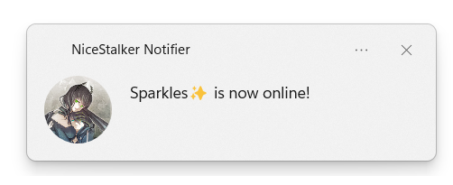

# NiceStalker

_"Day walker, night stalker."_

NiceStalker is a simple Discord bot designed to notify users when people become online on Discord. The project name is a playful nod to [Night Stalker](https://www.dota2.com/hero/nightstalker), a character from the popular game Dota 2.

<p align="center">
  
</p>

## Features

:white_check_mark: **Real-time notifications:** NiceStalker keeps track of users' statuses and sends notifications whenever someone comes online on Discord.

:white_check_mark: **Customizable settings:** You can customize your notification preferences, including which users to monitor.

:white_check_mark: **Tray Option**: NiceStalker provides a tray icon functionality allowing you to run the app in the background and access it conveniently from the system tray. NiceStalker can also be stopped through the tray icon menu.

:negative_squared_cross_mark: **Automatic startup:** If required, NiceStalker can automatically start up on system boot, ensuring that you never miss out on any important alerts.

:negative_squared_cross_mark: **Easy-to-use interface for configuring the app** NiceStalker offers an intuitive interface to configure the bot's settings. You can easily adjust your notification preferences without the need to use any command-line commands directly.

## Installation

To install NiceStalker, follow these steps:

1. Clone the repository to your local machine.

```bash
git clone https://github.com/naghim/NiceStalker.git
```

2. Install the necessary dependencies.

```bash
python -m pip install -r requirements.txt
```

3. Ensure that you are logged into the Discord client.

4. _Optional:_ Configure the bot: see steps below.

5. Run the bot.

```bash
python -m nicestalker.notifier
```

## Configuration

NiceStalker allows you to customize your notification preferences by configuring a `config.json` file. Currently, this is the primary method for configuring the bot's behavior. Follow the steps below to set up your configuration:

1. Create a file named `config.json` in the root directory of the NiceStalker project.

2. Use the following scheme to structure your `config.json` file:

```json
{
  "peopleToStalk": ["discord_username", "discord_displayname"]
}
```

Replace `"discord_username"` and `"discord_displayname"` with the Discord usernames (users' unique identifier) or display names (which is shown to other users) of the individuals you wish to monitor. NiceStalker will notify you whenever these users become online.

**Note:** NiceStalker also supports partial matches for usernames and display names. If you provide a partial username or display name, NiceStalker will match it with any user whose username or display name contains the provided text.

If the `"peopleToStalk"` array is left blank, NiceStalker will notify you whenever **any** user becomes online.
