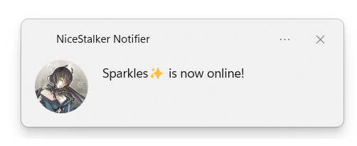

# NiceStalker

_"Day walker, night stalker."_

NiceStalker is a simple Discord bot designed to notify users when people become online or start activities on Discord. The project's name is a playful nod to [Night Stalker](https://www.dota2.com/hero/nightstalker), a character from the popular game Dota 2.

<p align="center">
  
</p>

## Features

:white_check_mark: **Real-time notifications:** NiceStalker keeps track of users' statuses and sends notifications whenever someone comes online on Discord.

:white_check_mark: **Activity tracking:** NiceStalker also notifies you when a monitored user starts playing a game or launches an activity.

:white_check_mark: **Customizable settings:** You can customize your notification preferences, including which users to monitor.

:white_check_mark: **Tray Option**: NiceStalker provides a tray icon functionality allowing you to run the app in the background and access it conveniently from the system tray. NiceStalker can also be stopped through the tray icon menu.

:white_check_mark: **Automatic startup:** If required, NiceStalker can automatically start up on system boot, ensuring that you never miss out on any important alerts.

:white_check_mark: **Easy-to-use interface for configuring the app** NiceStalker offers an intuitive interface to configure the bot's settings. You can easily adjust your notification preferences without the need to use any command-line commands directly.

## Installation

### Windows

1. Download the latest release from the [Releases](https://github.com/naghim/NiceStalker/releases) page.

2. Double-click the downloaded `.exe` file to install the application.

3. Start the application, configure the settings and press "Start". To automatically run the application on startup, check the corresponding checkbox.

### Linux

1. Download the latest `NiceStalker` binary from the [Releases](https://github.com/naghim/NiceStalker/releases) page.

2. Make it executable and run it:

```bash
chmod +x NiceStalker
./NiceStalker
```

3. Ensure the following system packages are installed (most desktop distros include these by default):
   - `libnotify` - for desktop notifications (`notify-send`)
   - `libappindicator3` - for the system tray icon (optional)

### macOS

Currently, there is no standalone executable for macOS. You can still run NiceStalker using Python as described below.

### Using Python

#### Pre-requisites

Ensure that you have Python 3.12 or newer installed on your system.

#### Installation Steps

To install NiceStalker, follow these steps:

1. Clone the repository to your local machine.

```bash
git clone https://github.com/naghim/NiceStalker.git
```

2. Create and activate a virtual environment, then install the necessary dependencies.

```bash
python -m venv --system-site-packages .venv
source .venv/bin/activate      # Linux/macOS
.venv\Scripts\activate         # Windows
pip install -r requirements.txt
```

3. Ensure that you are logged into the Discord client.

4. _Optional:_ Configure the bot: see steps below.

5. Run the bot.

```bash
python -m nicestalker
```

Adding the `--discord` flag at the end will only run the bot without the GUI.

## Configuration

NiceStalker allows you to customize your notification preferences via a `config.json` file. The preferred way of configuration is through the GUI. However, you can also edit the `config.json` file manually.

For manual configuration, follow the steps below to set up your bot:

1. Create a file named `config.json` in the root directory of the NiceStalker project.

2. Use the following scheme to structure your `config.json` file:

```json
{
  "peopleToStalk": ["discord_username", "discord_displayname"],
  "peopleToIgnore": ["discord_username", "discord_displayname"],
  "runOnStartup": true
}
```

Replace `"discord_username"` and `"discord_displayname"` with the Discord usernames (users' unique identifier) or display names (which is shown to other users) of the individuals you wish to monitor. NiceStalker will notify you whenever these users become online.

**Note:** NiceStalker also supports partial matches for usernames and display names. If you provide a partial username or display name, NiceStalker will match it with any user whose username or display name contains the provided text.

If the `"peopleToStalk"` array is left blank, NiceStalker will notify you whenever **any** user becomes online.

There is also an option to blacklist users. Create another array in the `config.json` file named `"peopleToIgnore"` to add users to the list.

NiceStalker can also be configured to run on startup, to do so, add `"runOnStartup": true` to the config file.
